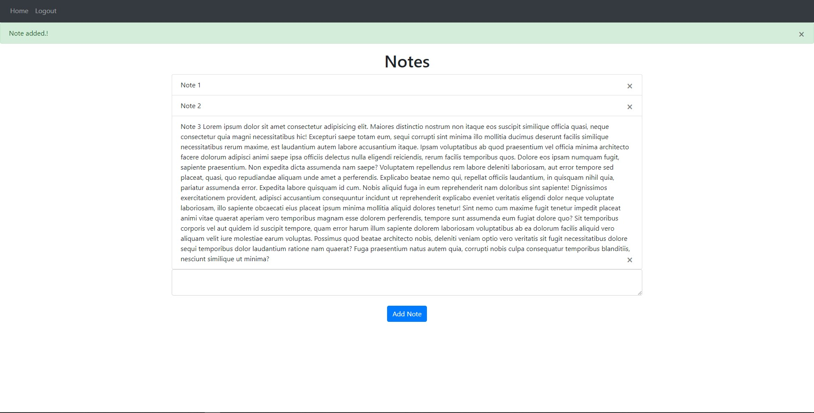

# takeNoteApp

This is very simple web app to store notes. You can create account and take some notes.




---
## Installation
> Installation requires Python3 and Virtualenv
```bash
~$ git clone https://github.com/aesavas/takeNoteApp.git and cd takeNoteApp
~$ python -m virtualenv venv
~$ source venv/Scripts/activate
~$ pip install -r requirements.txt
~$ env FLASK_APP=main.py
~$ env FLASK_ENV=1
~$ flask run
```

Please visit the address with a web browser.

> Project URL (/localhost:5000): http://127.0.0.1:5000/

## Used Technologies

* [flask] - Micro web framework
* [flask-sqlalchemy] - Flask-SQLAlchemy is an extension for Flask that adds support for SQLAlchemy to your application.
* [flask-login] - Flask-Login provides user session management for Flask. It handles the common tasks of logging in, logging out, and remembering your users’ sessions over extended periods of time.
* [bootstrap] - For fast and responsive front-end design.

[flask]: <http://flask.pocoo.org>
[flask-sqlalchemy]: <https://flask-sqlalchemy.palletsprojects.com/en/2.x/>
[flask-login]: <https://flask-login.readthedocs.io/en/latest/>
[bootstrap]: <https://getbootstrap.com/docs/4.5/getting-started/introduction/>
